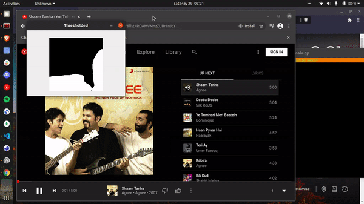

## yt-music hand controller :notes: :vulcan_salute:

Use hand gestures to control youtube music next,prev and play buttons.

### Controls [WIP]

| Hand Gesture | Control                             |
| ------------ | ----------------------------------- |
| 3 finger     | Prev Button :previous_track_button: |
| 4 finger     | Next Button :next_track_button:     |

### How to run :running_man:

1. Download the selenium driver for chrome from [here.](https://sites.google.com/a/chromium.org/chromedriver/downloads) and paste it in the cloned folder.

2. Install the dependencies, this script uses python3

```python
pip3 install -r requirements.txt
```

3. Copy the URL for the playlist and run the script using

```python
python3 main.py <YOUR_URL_HERE>
```

### Working Demo

<p align="center"></p>
